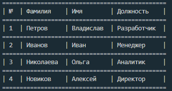

# RadarTestSolution
## Старт

```
$ npm install
$ npm start
```

## Таблица
`new Table(columnCount, rowCount, data)`
### Параметры
`columnCount` - Необязательный параметр. Количество колонок. Тип: number.  
`rowCount` - Необязательный параметр. Количество строк. Тип: number.  
`data` - Необязательный параметр. Данные таблцы. Тип: any[][].
### Пример:

```
const tableArr: any[] =
    [['№', 'Фамилия', 'Имя', 'Должность'],
    ['1', 'Петров', 'Владислав', 'Разработчик'],
    ['2', 'Иванов', 'Иван', 'Менеджер'],
    ['3', 'Николаева', 'Ольга', 'Аналитик'],
    ['4', 'Новиков', 'Алексей', 'Директор']];
const table = new Table();
table.setData(tableArr);
```



## Содержание

 - [print](#print)
 - [column](#column)
 - [row](#row)
 - [setData](#setdata)
 - [addColumn](#addcolumn)
 - [addRow](#addrow)
 - [removeColumn](#removecolumn)
 - [removeRow](#removerow)

## print
Метод `print()` выводи таблицу в консоль
### Пример
```
const table = new Table();
table.print();
```

## column
`column()` возвращает количество столбцов.
### Пример 
```
let column = table.column();
```
## row
`row()` возвращает количество строк.
### Пример
```
let row = table.row()
```
## setData
`setData()` устанавливает данные в определенную ячейку или заменяет все данные таблицы.
### Синтаксис
```
table.setData(data, columnCount, rowCount)
table.setData(Array[][])
```
### Параметры 
`data` - Любой тип данных. Значение ячейки.  
`columnCount` - number. Колонка, в которую нужно установить значение.  
`rowCount` - number. Строка, в которую нужно установить значение.  
`Array[][]` - any[][]. Двумерный массив.

### Пример
```
table.setData('Фамилия', 2, 1); // Устанавливает значение ячейки
table.setData([['Имя', 'Фамилия'], ['Петров', 'Владислав']]); // Меняет таблицу,  
//устанавливая значения массива.
```
## addColumn
`addColumn()` добавляет колонку в таблицу.
### Синтаксис
```
table.addColumn(columnCount, index);
table.addColumn(columnCount, isRight);
```
### Параметры
`columnCount` - Необязательный параметр. Тип: number. Количество колонок, которое нужно добавить. По умолчанию равен 1.   
`index` - Необязательный параметр. Тип: number. Индекс вставки колонки.  
`isRight` - Необязательный параметр. Тип: boolean. Если равен true, то колонка вставиться вправо, если false, то влево. По умолчанию равен true.  
### Пример
```
table.addColumn(); // Добавит колонку вправо
table.addColumn(2, false); // Добавить две колонки влево
table.addColumn(1, 2); //Вставит одну колонку во второй индекс.
```
## addRow
`addRow()` добавляет строку в таблицу.
### Синтаксис
```
table.addRow(rowCount, index);
table.addRow(rowCount, isBottom);
```
### Параметры
`rowCount` - Необязательный параметр. Тип: number. Количество строк, которое нужно добавить. По умолчанию равен 1.   
`index` - Необязательный параметр. Тип: number. Индекс вставки строки.  
`isBottom` - Необязательный параметр. Тип: boolean. Если равен true, то строка вставиться вниз, если false, то вверх таблицы. По умолчанию равен true.
### Пример
```
table.addRow(); // Добавит строку вниз таблицы
table.addRow(1, false); // Добавить одну строку вверх таблицы
table.addRow(2, 3); //Вставит две строки в третий индекс.
```
## removeColumn
`removeColumn()` удаляет колонки в таблице
### Синтаксис
```
table.removeColumn(columnCount, index);
table.removeColumn(columnCount, isBottom);
```
### Параметры
`columnCount` - Необязательный параметр. Тип: number. Количество колонок, которое нужно удалить. По умолчанию равен 1.   
`index` - Необязательный параметр. Тип: number. Индекс удаления колонки.  
`isRight` - Необязательный параметр. Тип: boolean. Если равен true, то колонка удалиться справа, если false, то вслева таблицы. По умолчанию равен true.
### Пример
```
table.removeColumn(); // Удалит колонку справа
table.removeColumn(3, false); // Удалит три колонки слева таблицы
table.removeColumn(1, 3); // Удалит третью колонку
```
## removeRow
`removeRow()` удаляет строкив в таблице.
### Синтаксис
```
table.removeRow(rowCount, index);
table.removeRow(rowCount, isBottom);
```
### Параметры
`rowCount` - Необязательный параметр. Тип: number. Количество строк, которое нужно удалить. По умолчанию равен 1.   
`index` - Необязательный параметр. Тип: number. Индекс удаления колонки.  
`isBottom` - Необязательный параметр. Тип: boolean. Если равен true, то строка удалится снизу, если false, то сверху таблицы. По умолчанию равен true.
### Пример
```
table.removeRow(); // Удалит строку внизу таблицы
table.removeRow(2, false); // Удалит две строки сверху таблицы
table.removeRow(2, 3); //Удалит две строки, начиная с третьей.
```


